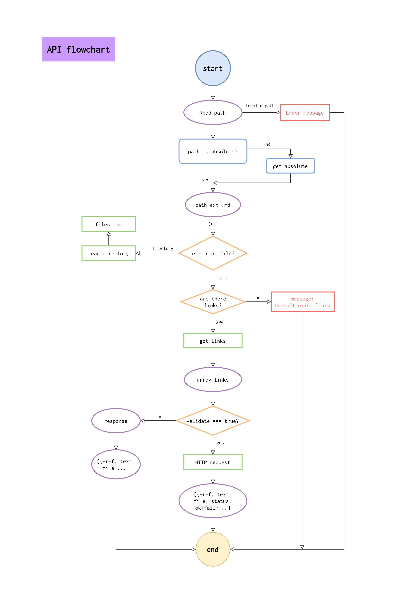
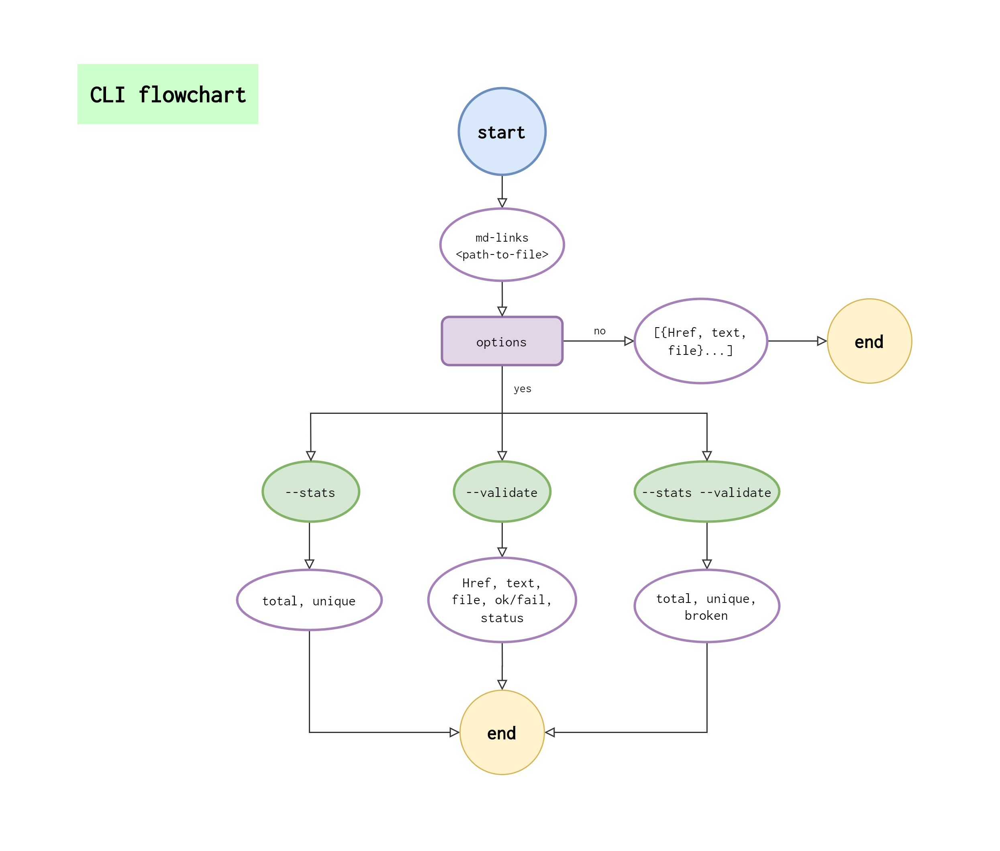
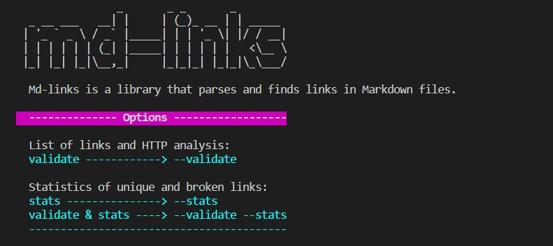
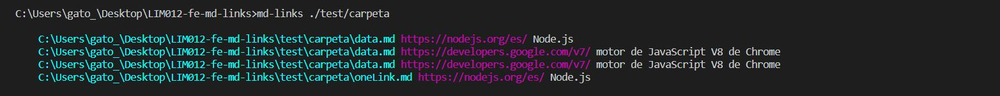
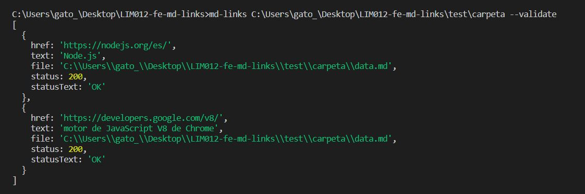
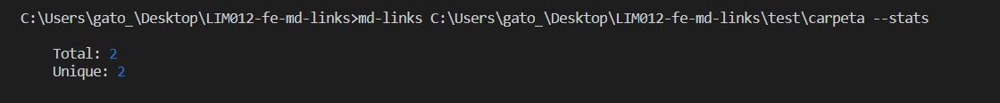
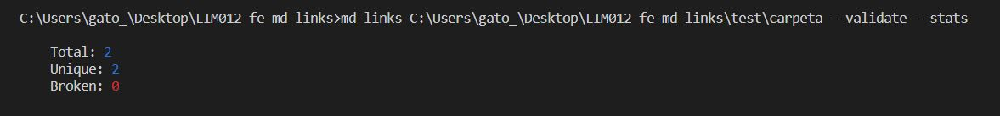

# Markdown Links

## Flowchart




## About

Md-links is a library that parses and finds links in Markdown files.

## :pushpin: Installation

`md-links install https://github.com/AliceRamirez17/LIM012-fe-md-links`

### :question: Help

`md-links --help`



## Get files

`md-links <path-to-file>`

For example:



#### Options

##### `--validate`

`md-links <path-to-file> --validate`

For example:



##### `--stats`

`md-links <path-to-file> --stats`

For example:



##### `--stats and --validate`

`md-links <path-to-file> --validate --stats`

For example:



## Boilerplate

```text
.
├── README.md
├── package.json
├── package-lock.json
├── .gitignore
├── lib
|  ├── utils.js
|  ├── mdLinks.js
|  ├── stats.js
|  ├── cliOptions.js
|  └── cli.js
└── test
   ├── utils.spec.js
   └── mdLinks.spec.js
```

## Objetivos de aprendizaje

### Javascript
- [x] Uso de callbacks
- [x] Consumo de Promesas
- [x] Creacion de Promesas
- [x] Modulos de Js
- [x] Recursión

### Node
- [x] Sistema de archivos
- [x] package.json
- [x] crear modules
- [x] Instalar y usar modules
- [x] npm scripts
- [x] CLI (Command Line Interface - Interfaz de Línea de Comando)

### Testing
- [x] Testeo de tus funciones
- [ ] Testeo asíncrono
- [ ] Uso de librerias de Mock
- [x] Mocks manuales
- [ ] Testeo para multiples Sistemas Operativos

### Git y Github
- [x] Organización en Github

### Buenas prácticas de desarrollo
- [x] Modularización
- [x] Nomenclatura / Semántica
- [x] Linting

***

## Author

[@AliceRamirez17](https://github.com/AliceRamirez17 "Alice's repository")