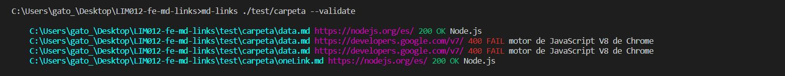

# Markdown Links

## Flowchart

## About

Md-links is a library that parses and finds links in Markdown files.

## :pushpin: Installation

`md-links install https://github.com/AliceRamirez17/LIM012-fe-md-links`

### :question: Help

`md-links --help`

## Get files

`md-links <path-to-file>`

For example:

#### Options

##### `--validate`

`md-links <path-to-file> --validate`

For example:

##### `--stats`

`md-links <path-to-file> --stats`

For example:

##### `--stats and --validate`

`md-links <path-to-file> --validate --stats`

For example:

## Objetivos de aprendizaje

### Javascript
- [ ] Uso de callbacks
- [✓] Consumo de Promesas
- [✓] Creacion de Promesas
- [✓] Modulos de Js
- [✓] Recursión

### Node
- [✓] Sistema de archivos
- [✓] package.json
- [ ] crear modules
- [✓] Instalar y usar modules
- [ ] npm scripts
- [✓] CLI (Command Line Interface - Interfaz de Línea de Comando)

### Testing
- [✓] Testeo de tus funciones
- [ ] Testeo asíncrono
- [ ] Uso de librerias de Mock
- [ ] Mocks manuales
- [ ] Testeo para multiples Sistemas Operativos

### Git y Github
- [✓] Organización en Github

### Buenas prácticas de desarrollo
- [✓] Modularización
- [✓] Nomenclatura / Semántica
- [ ] Linting

***

## Author

[@AliceRamirez17](https://github.com/AliceRamirez17 "Alice's repository")